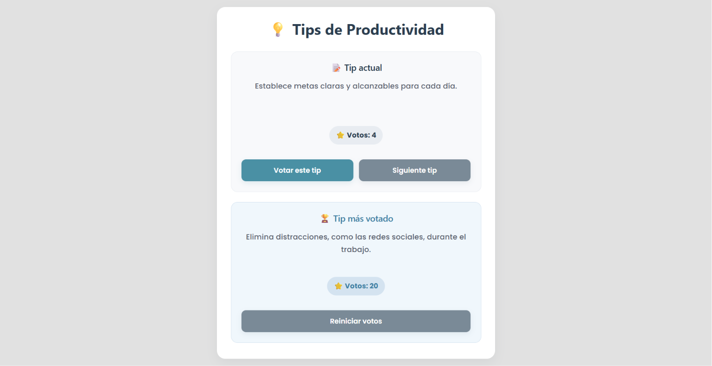

# Tips de Productividad

## Captura de pantalla de la aplicación funcionando

## ¿Qué hace la aplicación?

La aplicación muestra distintos tips de productividad de manera aleatoria.  
El usuario puede ir cambiando entre los tips con un botón y también puede votar el tip que más le guste.

Cada tip tiene su cantidad de votos, y esos votos se guardan en el navegador mediante localStorage, por lo que no se pierden al actualizar la página.

Además, existe un botón para reiniciar todos los votos y volverlos a cero.

También muestra automáticamente cuál es el tip con mayor cantidad de votos.

## ¿Cómo se ejecuta?

1. Tener instalado Node.js.
2. Abrir la carpeta del proyecto en Visual Studio Code.
3. Abrir la terminal.
4. Instalar dependencias con: npm install
5. Ejecutar la aplicación con: npm run dev
6. Abrir en el navegador la dirección que aparece en la terminal (http://localhost:5173/).

## ¿Qué conceptos de React se utilizaron?

En este trabajo se utilizaron conceptos básicos de React:

- Componentes: se creó el componente principal App y un componente reutilizable Boton.
- useState: se utilizó para guardar el estado de los tips, los votos y el tip actual mostrado.
- Props: se usaron en el componente Boton para enviar texto y funciones.
- Eventos: se utilizó onClick en los botones para ejecutar acciones.
- Renderizado dinámico: se muestran en pantalla los tips y votos según el estado actual, además del tip con más votos.
- Actualización de estado sin modificar directamente los datos: se hicieron copias de arrays y objetos.
- localStorage: se utilizó para guardar los votos en el navegador.